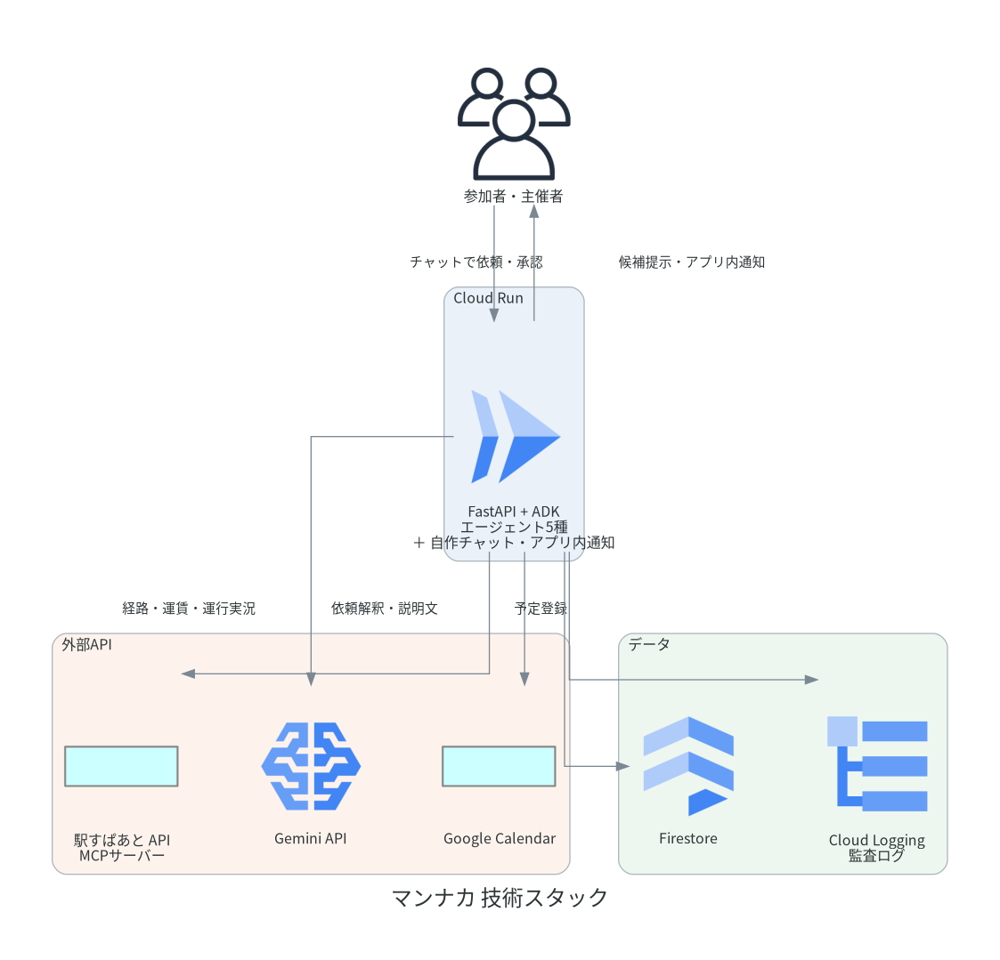

# マンナカ

N人会議場所最適化エージェント。参加者全員の出発駅から、宣言した公平性ポリシーで
会議場所を選び、会議室の確保・個別経路の配信・当日の遅延フォローまで一気通貫で実行する。

「いつも本社」で終わる場所決めを、公平性ポリシー付きの最適化とワンストップ手配に置き換える。

設計は [設計書.md](設計書.md)、開発手順は [CONTRIBUTING.md](CONTRIBUTING.md)、
Cloud Run へのデプロイは [DEPLOY.md](DEPLOY.md) を参照。

## 起動

```bash
docker compose up --build
```

<http://localhost:8081> でデモUIが開く。Firestore エミュレータも一緒に立ち上がり、
会議・チャット・通知はすべてそこに保存される。

## デモの流れ

1. **デモ参加者を登録** — 立川・三鷹・横浜・千葉・船橋・大宮の6名（4方向に散っている）
2. **チャットで依頼** — 「@マンナカ 来週火曜14時、この6人で。2時間、ホワイトボードのある部屋で。いちばん遠い人の負担を減らしたい」と投げると、日時・人数・設備・公平性ポリシーを読み取ってエージェントがその場に返信する
3. **候補地** — 3つのポリシータブを切り替えると**選ばれる駅が変わる**。1人ごとの内訳は匿名化して表示
4. **手配** — 会議室を仮押さえ。有料なら主催者承認が要る。上限額（既定5,000円）を超える部屋は承認ボタン自体が押せない
5. **確定** — カレンダー登録 → 各自にアプリ内通知（自分の出発時刻・運賃）／チャットには集計値のみ
6. **当日フォロー** — 「遅延を発生させる」→「運行状況を確認」で、開始時刻調整の**起案**が出る。承諾するまでカレンダーは変わらない
7. **監査ログ** — ポリシー選択・支出承認・リスケの証跡が全ステップ分残る

## 公平性ポリシー

同じ参加者でも、宣言する基準で結論が変わる。どれで選んだかを常に明示・記録する。

| ポリシー | 評価 | 意味 |
|---|---|---|
| `sum` | 合計移動時間最小 | 全体の移動を最小化する |
| `minimax` | 最大負担の平準化 | いちばん遠い人を最も楽にする |
| `cost` | 総運賃最小 | 経費を優先する |

## アーキテクチャ



| 区分 | 技術 |
|---|---|
| 実行基盤 | Cloud Run（FastAPI） |
| AI | Gemini API、Agent Development Kit（ADK） |
| スポンサー | 駅すぱあと API MCPサーバー |
| 連携 | Google Calendar API、会議室予約API（モック） |
| チャット・通知 | 自作（外部サービス非依存／通知はアプリ内のみ） |
| データ | Firestore（会議・参加者・チャット・通知・監査ログ） |
| 可観測性 | Cloud Logging（構造化JSONの監査ログ） |

## ガバナンス（設計書 §7 の実装箇所）

| 方針 | 実装 |
|---|---|
| 自宅を晒さない | `UserProfile` は最寄り駅のみ。チャットに出るのは集計値だけで、内訳は `CandidateArea.anonymized_legs()` で匿名化。個人の経路は本人宛の通知にしか出ない |
| 支出の権限制御 | `ArrangerAgent.decide_approval()` が主催者チェックと上限額チェックを二重に行う |
| 公平性の宣言 | `policy` は常に会議に保存され、提示文・確定連絡・監査ログのすべてに出る |
| 可観測性 | `AuditService` が Firestore と構造化JSONログの両方へ記録。候補の内訳・リスケの判断根拠も payload に含む |

## 現状と残り

**実装済み**: 依頼解釈、候補算出と3ポリシー、候補提示UI、会議室手配と承認ゲート、
カレンダー登録、個別配信、当日フォローの起案と承諾、監査ログ、REST API、
ADKエージェント定義、Firestoreリポジトリ、Cloud Run用コンテナ。

**モックのまま**: 駅すぱあとAPI/MCP、Google Calendar、Gemini。
いずれもアダプタは実装済みで、キーを入れて環境変数を切り替えれば繋がる
（実キーでの疎通確認は未実施）。会議室APIは設計書どおりMVP対象外。
