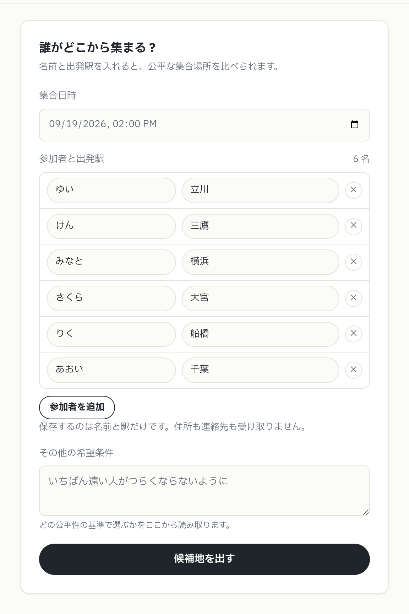
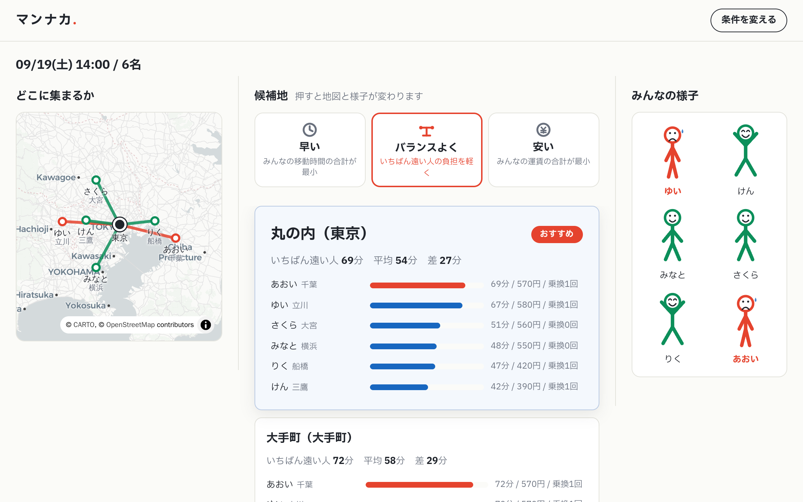
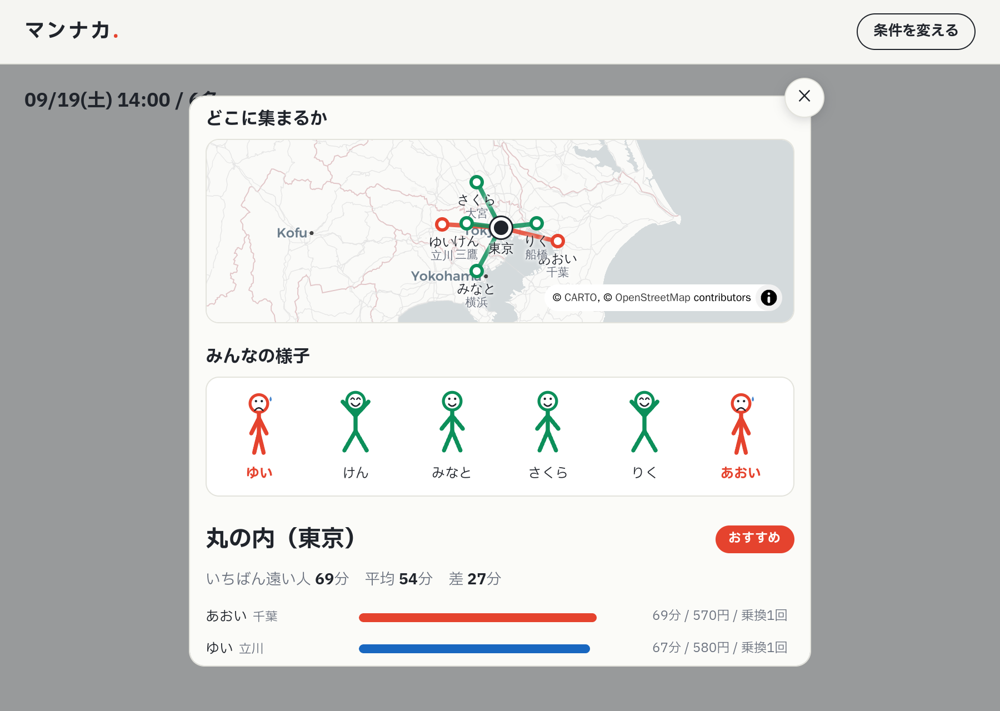

# マンナカ

参加者全員の出発駅から、集合場所の候補を並べ、**誰がどれだけ損をしているか**が人の表情でわかります。

「いつも本社」で終わる場所決めを、根拠を言える比較に置き換えます。

## 使い方

### 1. 名前と出発駅を入れる

### 2. 基準を切り替えて見比べる

左に地図（選択中の候補地と、誰がどこから来るか）、中央に候補、右にみんなの様子が並びます。
候補を押すと、地図も表情もその場所のものに変わります。

表情は、その候補地での移動時間の重さで変わります。楽なら万歳、いちばん重い人は
赤くうなだれます。

### 3. 狭い画面では1枚にまとめる

3カラムに足りない幅（1080px未満）では候補リストだけを出し、候補を押すと
地図・様子・その候補をひとつのモーダルに重ねて開きます。

どの基準でどう評価したかの証跡は、会議ごとに監査ログへ残ります。

## 公平性ポリシー

同じ参加者でも、宣言する基準で結論が変わります。どれで選んだかを常に明示・記録します。

| 画面の表示 | 意味 |
|---|---|
| 早い | みんなの移動時間の合計が最小 |
| バランスよく | いちばん遠い人の負担を軽くする |
| 安い | みんなの運賃の合計が最小 |

## アーキテクチャ

